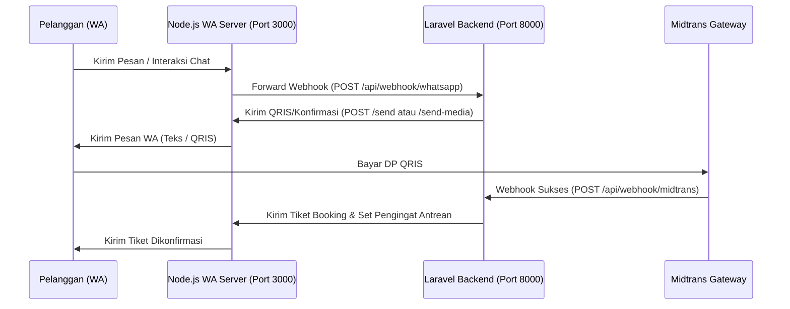

# Dokumentasi API - SISIR Barber

Dokumen ini memuat daftar endpoint API, webhook, dan rute AJAX yang digunakan pada aplikasi **SISIR Barber**, baik pada sisi Laravel Backend maupun Node.js WhatsApp Web Server.

---

## Daftar Isi
1. [Arsitektur Sistem](#1-arsitektur-sistem)
2. [Laravel Public Webhooks](#2-laravel-public-webhooks)
   - [WhatsApp Webhook Receiver](#post-apiwebhookwhatsapp)
   - [Midtrans Payment Webhook](#post-apiwebhookmidtrans)
3. [Laravel AJAX API (Authenticated)](#3-laravel-ajax-api-authenticated)
   - [Cek Slot Ketersediaan Kapster](#get-bookingslots)
   - [Buat Reservasi (Booking)](#post-booking)
   - [Detail Reservasi (JSON)](#get-bookingid)
   - [Transisi Status Reservasi](#post-bookingidtransition)
   - [Kirim Siaran Promo (Broadcast)](#post-settingspromosend)
4. [Node.js WhatsApp Server API](#4-nodejs-whatsapp-server-api)
   - [Kirim Pesan Teks](#post-send)
   - [Kirim Pesan Gambar (Media)](#post-send-media)
   - [Kirim Gambar Grid Jadwal (Puppeteer)](#post-send-schedule-image)

---

## 1. Arsitektur Sistem

Aplikasi SISIR Barber menggunakan arsitektur hybrid:
* **Laravel Backend** (`port 8000` / production): Mengelola database, logika bisnis utama (kapasitas, reservasi, laporan), autentikasi, serta berintegrasi dengan Midtrans Payment Gateway.
* **Node.js WhatsApp Server** (`port 3000`): Berfungsi sebagai jembatan WhatsApp Client menggunakan library `whatsapp-web.js` (Puppeteer) untuk memindai QR Code, memantau pesan masuk (webhook), serta mengirimkan notifikasi.



---

## 2. Laravel Public Webhooks

### `POST /api/webhook/whatsapp`
Digunakan oleh Node.js WhatsApp Server untuk mengirimkan pesan masuk dari pelanggan agar diproses oleh logika percakapan AI Gemini.

* **URL:** `http://127.0.0.1:8000/api/webhook/whatsapp`
* **Autentikasi:** Tidak ada (Local network).
* **Payload Request (JSON):**
  ```json
  {
    "from": "628123456789@c.us",
    "text": "Saya mau booking cukur dewasa besok jam 10",
    "id": "true_628123456789@c.us_3EB0C3483984392849"
  }
  ```
* **Respons:**
  * **200 OK:** Webhook berhasil diterima dan diproses.
    ```json
    "OK"
    ```

---

### `POST /api/webhook/midtrans`
Menerima pemberitahuan pembayaran DP dari Midtrans secara asinkron. Webhook ini akan mengubah status booking dari `TEMP_LOCKED` ke `BOOKED` dan memicu pengiriman tiket konfirmasi serta pengingat waktu (reminders).

* **URL:** `http://127.0.0.1:8000/api/webhook/midtrans`
* **Middleware:** `verify.midtrans` (Memvalidasi hash signature SHA512 dari Midtrans).
* **Payload Request (JSON):**
  *(Sesuai standar payload notifikasi Midtrans)*
  ```json
  {
    "transaction_time": "2026-06-20 11:45:00",
    "transaction_status": "settlement",
    "status_message": "midtrans payment notification",
    "status_code": "200",
    "signature_key": "sha512-hash-signature...",
    "payment_type": "qris",
    "order_id": "SISIR-BOOK-109283",
    "gross_amount": "20000.00",
    "fraud_status": "accept",
    "transaction_id": "midtrans-uuid-transaction-..."
  }
  ```
* **Respons:**
  * **200 OK:**
    ```json
    "OK"
    ```
  * **401 Unauthorized:** Tanda tangan (signature key) tidak valid.

---

## 3. Laravel AJAX API (Authenticated)

Seluruh endpoint berikut berada dalam middleware `sisir.auth` (membutuhkan sesi login admin/pelanggan yang valid).

### `GET /booking/slots`
Mengambil slot waktu pengerjaan yang tersedia untuk kapster (barber) tertentu pada tanggal yang dipilih.

* **URL:** `/booking/slots`
* **Parameter Query:**
  | Parameter | Tipe | Wajib | Keterangan |
  | :--- | :--- | :--- | :--- |
  | `barber_id` | Integer | Ya | ID unik kapster |
  | `date` | String (YYYY-MM-DD) | Ya | Tanggal yang ingin dipesan |
* **Contoh Request:** `/booking/slots?barber_id=1&date=2026-06-21`
* **Respons (200 OK):**
  ```json
  {
    "slots": [
      {
        "time": "09:00",
        "available": true,
        "reason": "Available"
      },
      {
        "time": "09:30",
        "available": false,
        "reason": "Fully Booked"
      }
    ]
  }
  ```

---

### `POST /booking`
Membuat reservasi booking baru oleh pelanggan dan menghasilkan link pembayaran DP via QRIS Midtrans. Slot waktu akan dikunci sementara (`TEMP_LOCKED`) selama 10 menit.

* **URL:** `/booking`
* **Payload Request (JSON / Form Data):**
  | Parameter | Tipe | Wajib | Keterangan |
  | :--- | :--- | :--- | :--- |
  | `barber_id` | Integer | Ya | ID kapster pilihan |
  | `service_id` | Integer | Ya | ID layanan yang dipilih |
  | `scheduled_at` | String (DateTime) | Ya | Format: `YYYY-MM-DD HH:MM` (Harus waktu masa depan) |
  | `name` | String | Ya | Nama lengkap pelanggan |
  | `phone` | String | Ya | Nomor WhatsApp (min: 7, max: 15 digit) |
* **Respons (200 OK - Sukses dengan QRIS):**
  ```json
  {
    "success": true,
    "booking_id": 45,
    "qr_code_url": "https://api.sandbox.midtrans.com/v2/qris/.../qr-code.png",
    "dp_amount": 20000,
    "expires_in": 600,
    "order_id": "SISIR-BOOK-171887304"
  }
  ```
* **Respons (409 Conflict - Slot Sudah Diambil):**
  ```json
  {
    "error": "Slot sudah terisi. Pilih waktu lain."
  }
  ```

---

### `GET /booking/{id}`
Mendapatkan detail data suatu booking untuk kebutuhan rendering modal AJAX di Dashboard Admin atau Customer.

* **URL:** `/booking/{id}` (Contoh: `/booking/45`)
* **Respons (200 OK):**
  ```json
  {
    "id": 45,
    "id_formatted": "2026-0045",
    "customer_name": "Reza Firmansyah",
    "customer_phone": "6281234567001",
    "service_name": "Cukur Dewasa",
    "service_price": "35.000",
    "barber_name": "Bang Budi",
    "scheduled_at": "Minggu, 21 Juni 2026 - 10:00 WIB",
    "status": "BOOKED",
    "status_label": "Terkonfirmasi (DP Lunas)",
    "status_color": "info",
    "dp_amount": "17.500",
    "remaining_pay": "17.500",
    "qr_code_url": "https://...",
    "midtrans_order": "SISIR-BOOK-171887304"
  }
  ```

---

### `POST /booking/{id}/transition`
Mengubah status reservasi (transisi status pengerjaan) oleh Admin.

* **URL:** `/booking/{id}/transition` (Contoh: `/booking/45/transition`)
* **Payload Request (JSON / Form Data):**
  * `status`: Nilai enum target yang valid.
* **Nilai Status Target Valid:**
  * `CONFIRMED` (Pelanggan Hadir di Toko)
  * `IN_SERVICE` (Sedang Dicukur)
  * `COMPLETED` (Selesai Cukur - Slot Dibebaskan)
  * `NO_SHOW` (Tidak Hadir - DP Hangus, Slot Dibebaskan)
  * `CANCELLED_BY_SYSTEM` (Dibatalkan)
* **Respons (200 OK - Sukses):**
  ```json
  {
    "success": true,
    "status": "IN_SERVICE",
    "status_label": "Sedang Dilayani",
    "status_color": "success"
  }
  ```
* **Respons (422 Unprocessable Entity - Transisi Ilegal):**
  ```json
  {
    "error": "Illegal transition from COMPLETED to IN_SERVICE"
  }
  ```

---

### `POST /settings/promo/send`
Memicu siaran promo penawaran slot kosong (Flash Discount) via WhatsApp secara massal ke daftar tunggu (Waitlist).

* **URL:** `/settings/promo/send`
* **Payload Request (JSON):**
  * `discount_amount`: Angka nilai diskon (minimal 1000, maksimal 500000).
* **Respons (200 OK):**
  ```json
  {
    "success": true,
    "message": "Promo broadcast dijadwalkan! Pesan akan dikirim ke semua pelanggan waitlist."
  }
  ```

---

## 4. Node.js WhatsApp Server API

Server Node.js berjalan di `http://localhost:3000` (atau port pilihan) dan bertindak sebagai API client WhatsApp Web.

### `POST /send`
Mengirimkan pesan teks biasa ke nomor WhatsApp pelanggan.

* **URL:** `http://localhost:3000/send`
* **Payload Request (JSON):**
  ```json
  {
    "to": "628123456789",
    "message": "Halo Kak! Pengingat jadwal cukur Anda 1 jam lagi ya. 🪒"
  }
  ```
* **Respons (200 OK):**
  ```json
  {
    "success": true,
    "response": {
      "id": {
        "fromMe": true,
        "remote": "628123456789@c.us",
        "id": "3EB0C3483984392849"
      },
      "body": "Halo Kak! Pengingat jadwal cukur Anda 1 jam lagi ya. 🪒"
    }
  }
  ```

---

### `POST /send-media`
Mengirimkan gambar atau file media lainnya beserta teks takarir (caption). Digunakan untuk mengirim QRIS Midtrans.

* **URL:** `http://localhost:3000/send-media`
* **Payload Request (JSON):**
  ```json
  {
    "to": "628123456789",
    "mediaUrl": "https://api.sandbox.midtrans.com/v2/qris/.../qr-code.png",
    "message": "Silakan scan kode QRIS ini untuk membayar DP reservasi Anda."
  }
  ```
* **Respons (200 OK):**
  ```json
  {
    "success": true,
    "response": { ... }
  }
  ```

---

### `POST /send-schedule-image`
Mengambil screenshot grid jadwal operasional barbershop untuk tanggal tertentu secara dinamis menggunakan Puppeteer, lalu mengirimkannya sebagai gambar ke pelanggan.

* **URL:** `http://localhost:3000/send-schedule-image`
* **Payload Request (JSON):**
  ```json
  {
    "to": "628123456789",
    "date": "2026-06-21",
    "htmlUrl": "http://127.0.0.1:8000/booking/schedule-image-html?date=2026-06-21",
    "message": "Berikut ketersediaan slot kapster kami untuk tanggal 2026-06-21 ✂️"
  }
  ```
* **Respons (200 OK):**
  ```json
  {
    "success": true,
    "response": { ... }
  }
  ```
